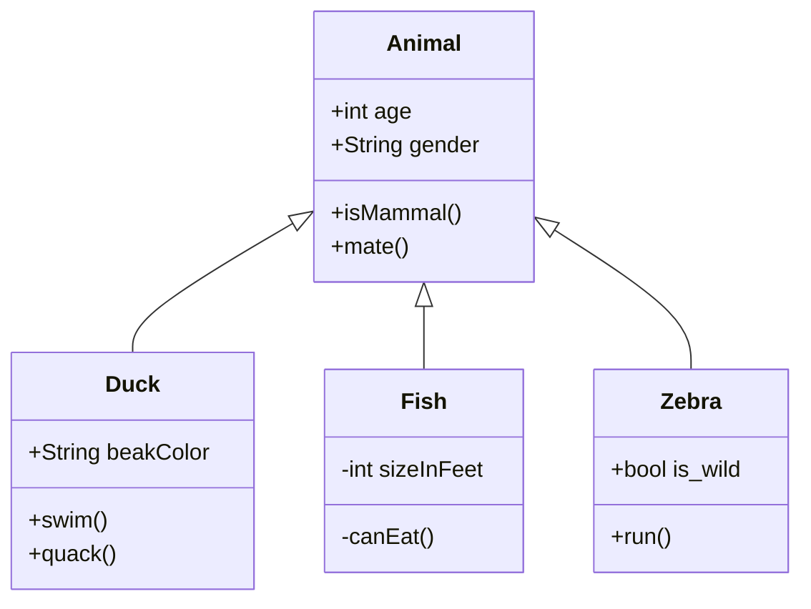
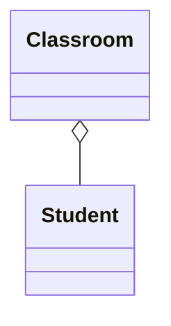
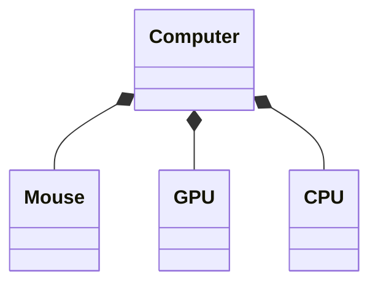

[TOC]

# uml类图

https://design-patterns.readthedocs.io/zh_CN/latest/read_uml.html

## 使用Typora绘制UML类图

### 关系

- 实现：B实现A接口`A<|..B`
- 派生：A派生B`A<|--B`
- 组合：`Computer *-- CPU`
- 聚合：`Company o-- Empolyee`
- 关联：`Reader "1..*" -- "1..*" Book`
- 依赖：`Animal..>Food`

### 其他

- 声明接口`class XXX { <<interface>> }`

## 访问权限

- 属性访问权限+、-、#、～对应public、private、protected、package（internal）

## 类间关系

- generalization：**实线空心箭头**
- inheritance（is-a）：**虚线空心箭头**
- association：**实线直线箭头**，默认不强调方向
- aggregation：**实线空心棱形**，集体和个体为弱依赖关系，集体解散个体仍存在
- composition（has-a）：**实线实心棱形**，集体和个体为强依赖关系，集体解散个体消失
- dependency：**虚线直线箭头**，是一种临时性的关系，可能发生变化

## 组合和聚合的区别

组合和聚合表达的都是部分与整体的关系，聚合（空心棱形）是一种弱关联，个体的生命周期可以超越整体，组合（实心棱形）则是强关联，个体的生命周期与整体一致。

### 聚合例子：班级

学生（人）与班级是一种聚合关系，班级的解散并不会引起学生（人）的消失，失去了班级的学生（人）仍然存在其他价值，比如仍然可以以聚合的方式形成另外的集体，比如小型社团、公司等等。

### 组合例子：电脑

电脑及其部件是一种组合关系，电脑由鼠标、GPU、CPU等零部件组成，这些零部件是为了组装成为电脑而被制造出来，如果将电脑拆开，这些零部件无法运行，已经失去其存在的意义，即个体的生命周期与整体一致。